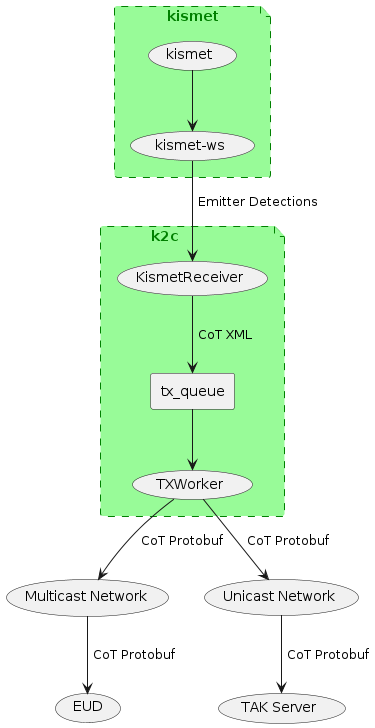

# kismet2cot
A Python script that subscribes to kismet emitter detections and outputs them in cot format.

# Install
## Raspberry Pi

This project was targeted for a Raspberry Pi platform but should work anywhere kismet does.

Install latest 64-bit Rasperry Pi OS using the sdcard imager (https://www.raspberrypi.com/software/)

## Kismet 

See https://www.kismetwireless.net/ for documentation.

Install the debian 64-bit version (https://www.kismetwireless.net/packages/#debian-bullseye)

Don't forget to run the usermod command to add your username to the kismet group. Follow this instruction: https://www.kismetwireless.net/docs/readme/installing/linux/#setting-up-the-group

Configure kismet to automatically begin capturing from the wifi device at startup. You can discover the device name by running kismet and pointing your browser at http://localhost:2501/. Select Data Sources from the 3 line menu icon (upper left). There will likely be 3 "Available Interfaces"; 1 bluetooth and 2 wifi. 1 wifi is the builtin RPi wifi. The other one is what you want to use. Configure kismet by modifying the source= value in /etc/kismet_site.conf to point to your wi-fi radio (See https://www.kismetwireless.net/docs/readme/configuring/configfiles/#customizing-configs-with-kismet_siteconf).

## kismet2cot

k2c.py expects a Python 3.11+ environment. This should grab the latest version:
>sudo apt update

>sudo apt install python

Assuming that you're on the kismet2cot github.com page, click on the the green CODE button above and download the zip file. Unzip that file and cd into it's directory.

Dependant libraries are captured in requirements.txt and can be installed by running:
>pip install -r requirements.txt

# kismet2cot Configuration
Modify the USER and PW variables in the config.ini file. They should match whatever user and password you created the first time you ran kismet.

Modify the KISMET_HOST if it's not running on the same computer as kismet2cot.

Modify the COT_URL and TAK_PROTO based on where you intend to send the cot. See config.ini file.

Debugging output is seen on the console and logged to a file called debug.log in the directory where k2c.py is run. To turn that off, simply rename the logging.ini file to something else and restart k2c.py.

# Usage
Simply run the main script:

>python k2c.py

You can run kismet first or k2c.py first. Doesn't matter.

To view debugging output on the console, pass in -log=debug like so:

>python k2c.py -log=debug

# Design
A kismet plugin was considered. A c++ version would require binaries to be generated for every possible platform (intel, arm, etc.). A script solution will be more portable. kismet also allows Javascript plugins. But Javascript does not allow TCP connections to be made, which prevents sending out cot on unicast or multicast. NodeJS would work, but there's a decent TAK library for python (PyTAK) that takes care of protobuf, certificates, etc. Not sure if that exists for NodeJS.

A Python script was determined to be the best solution since it is portable, simple, field extensible and can work transparently behind the scenes once installed.

The PyTAK library (See https://github.com/snstac/pytak) has the CoT side solved, so it was used for sending out CoT. PyTAK also leverages Python's asyncio feature to ensure network data inputs don't get dropped. kismet2cot followed their same architecture to keep things simple and consistent.

kismet has a python-kismet-rest library (See https://github.com/kismetwireless/python-kismet-rest) which handles all the REST API communication, however it does not appear to handle realtime updates, so this part was implemented from scratch.

config.ini also defines where CoT is sent (unicast to TAKServer or multicast to all local End User Devices). Modify accordingly.

Which kismet fields should be mapped to which cot fields is a work in progress.

For reference, the schema files for CoT are located at https://github.com/deptofdefense/AndroidTacticalAssaultKit-CIV/tree/master/takcot/xsd

